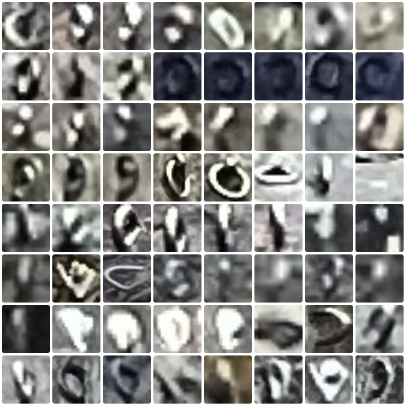

# OpenClimbing Bolts AI

This project uses custom neural network to recognize bolts on a photo.

DEMO: https://zbycz.github.io/openclimbing-bolts-ai/ \
(and [PR here](https://github.com/jvaclavik/openclimbing/pull/105))

## Technical details

Since the launch of OpenClimbing.org we have gathered 3500 bolts marked on 200 photos. This seemed to be enough data to train a neural net. The route data are stored in OpenStreetMap database and photos on the Wikimedia Commons image server. That made it very simple to extract it and start the training.

Of course not every bolt in the DB is precisely marked on the spot of the actual bolt on a rock face. Sometimes the bolt is not visible from ground, sometimes the contributor just placed it off by some distance. We had to human-check every bolt and mark the exact location of each bolt. This is called "labeling the dataset". The result was a dataset of 1319 verified bolts with exact bounding boxes. See [here](https://zbycz.github.io/openclimbing-bolts-ai/training/).

There is a perfect base model for this usecase – the [YOLOv8 nano](https://huggingface.co/Ultralytics/YOLOv8), which has the basic knowledge of world, and can be trained with any specific dataset. We used the [Kaggle](https://www.kaggle.com/) free tier, which offers generous amount of NVIDIA P100 GPUs. The training took 2 hours, lasted 62 epochs and gained mAP50 = 51% on the validation set.

The YOLO model (You Only Look Once) is a deep convolutional neural network. The architecture consists of a CSPDarknet backbone (feature extraction), a PANet neck (multi-scale fusion), and a detection head. It has aproximately 3 milions of parameters, in tens of layers. Everything fits inside a 12 MB ONNX file.

Because the features (bolts) are sometimes only few pixes big, we had to split the source image into overlaping 1024x1024px tiles, and feed the model the 1:1 source pixels.

The inference runs in browser about 10 seconds per image. Measured on Macbook Air M1 and iPhone 12 mini. We use [onnxruntime-web](https://github.com/Microsoft/onnxruntime) with WASM backend. Everything runs locally without sending any data to a server.

## Attribution

This model was trained on data from OpenStreetMap (ODbL), and photos from Wikimedia Commons (CC0 / CC BY / CC BY-SA) by:
[Alensiljak](https://commons.wikimedia.org/wiki/User:Alensiljak) ·
[Daniel Baránek](https://commons.wikimedia.org/wiki/User:Daniel_Bar%C3%A1nek) ·
[Jvaclavik](https://commons.wikimedia.org/wiki/User:Jvaclavik) ·
[Supernova-implicate-awoke](https://commons.wikimedia.org/wiki/User:Supernova-implicate-awoke) ·
[Headbucket](https://commons.wikimedia.org/wiki/User:Headbucket) ·
[Osmwithspace](https://commons.wikimedia.org/wiki/User:Osmwithspace) ·
[Zbytovsky](https://commons.wikimedia.org/wiki/User:Zbytovsky) ·
[GabriCosta00](https://commons.wikimedia.org/wiki/User:GabriCosta00) ·
[Geogast](https://commons.wikimedia.org/wiki/User:Geogast) ·
[Kuba Turek](https://commons.wikimedia.org/wiki/User:Kuba_Turek) ·
[Eric](https://commons.wikimedia.org/wiki/File:Narrenturm,_top.jpg)

## License

The model weights: [CC BY 4.0](https://creativecommons.org/licenses/by/4.0/)

